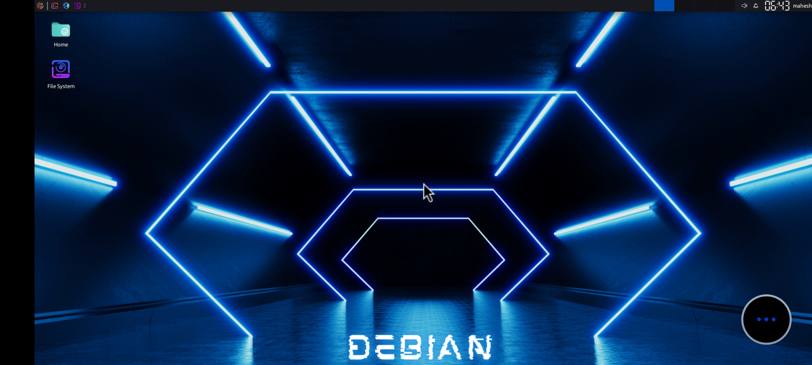
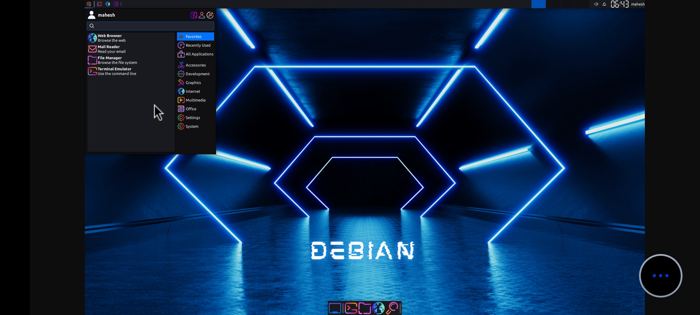

# 🐧 Moded Debian Script



[](https://github.com/MaheshTechnicals/Moded-Debian/stargazers)
[](https://github.com/MaheshTechnicals/Moded-Debian/network/members)
[](https://github.com/MaheshTechnicals/Moded-Debian/issues)
[](./LICENSE)
[](https://github.com/MaheshTechnicals/Moded-Debian/commits/main)

**Run Debian Linux GUI on Android using Termux — fast, stable, and beautifully customized.**  
Experience the power of a full Debian desktop environment directly on your Android device with **Modded Debian by Mahesh Technicals.**  
This enhanced version comes with preinstalled developer tools, optimized performance, and a modern graphical interface that brings the true Linux experience to mobile.
---

## 🚀 Key Features

✅ **Audio Fixed** – Full sound support in Termux (Proot-Distro)  
✅ **Lightweight RootFS** – Requires only ~4 GB storage  
✅ **Dual Browser Setup** – Chromium + Mozilla Firefox  
✅ **Bangla Font Support** – Perfect for multilingual users  
✅ **Preinstalled Media Players** – VLC & MPV  
✅ **Code Ready** – Visual Studio Code (arm64/aarch64) & Sublime Text  
✅ **User-Friendly Installer** – Designed for beginners  
✅ **Beautiful UI** – Modern icons, wallpapers, and system themes  

---

## 📦 Installation Guide
### 🧩 Step 1 — Install Termux & Termux:API

To get started, you need to install both the **Termux** app and the **Termux:API** add-on.  
These two applications work together to enable full system functionality and hardware integration.

#### 📱 Download Links
- **🔗 Termux App (v0.118.3)** — [Download from GitHub](https://github.com/termux/termux-app/releases/tag/v0.118.3)  
- **🔗 Termux:API Add-on (v0.53.0)** — [Download from GitHub](https://github.com/termux/termux-api/releases/tag/v0.53.0)

> 💡 **Note:** Both apps are officially maintained on GitHub. Avoid downloading from the Google Play Store, as it may contain outdated versions.

### Step 2 — Clone Repository and Setup
```bash
apt update && apt upgrade -y
pkg install git wget -y
git clone --depth=1 https://github.com/MaheshTechnicals/Moded-Debian.git
cd Moded-Debian
bash setup.sh
```

### Step 3 — Launch Debian CLI
After installation completes, **restart Termux** and type:
```bash
debian
bash user.sh
```
> Enter your root username (lowercase, no spaces).

### Step 4 — Launch Debian GUI
Restart Termux again and type:
```bash
debian
sudo bash gui.sh
```
> Set and remember your **VNC password**.

### Step 5 — Start and Stop GUI
```bash
vncstart   # Start Debian GUI
vncstop    # Stop Debian GUI
```

### Step 6 — Connect Using VNC Viewer
1. Install **[VNC Viewer](https://play.google.com/store/apps/details?id=com.realvnc.viewer.android&hl=en)** on your phone.  
2. Create a new connection:
   - **Address:** `localhost:1`
   - **Name:** `Debian`
   - **Quality:** High
3. Connect & enjoy Debian Desktop on Android!

---

## 💡 Notes

- Use `debian` command anytime to enter the Debian CLI.  
- To start the GUI session: `vncstart`  
- To stop the GUI session: `vncstop`  
- To **remove Debian completely**, run:
  ```bash
  bash remove.sh
  ```
- You must have **at least 4 GB free storage** before installation.

---

## 🎥 Video Tutorial

Watch the setup tutorial below for a complete walkthrough:  
[](https://mega.nz/embed/QvIC1TLQ#3z27MRNPwANAg6JTtx1Ei8kDouOZsZgk00bg4TsJMNQ!1m)

---

## 🔄 Changelog

See the full list of updates and improvements here:  
👉 [CHANGELOG.md](./CHANGELOG.md)

---

## 🛠️ Technical Info

- **Base Distro:** Debian (Proot-Distro)
- **Architecture:** aarch64 / arm64
- **Display Server:** TightVNC
- **Desktop Environment:** XFCE4
- **Developed For:** Android (Termux)
- **Minimum Storage Required:** 4 GB free

---

## 🧠 Troubleshooting

**Q:** VNC session not connecting?  
**A:** Restart Termux and type:
```bash
debian
vncstart
```
Then reconnect via VNC Viewer.

**Q:** Audio not working?  
**A:** Run `pavucontrol` inside Debian GUI and make sure output device is not muted.

---

## 🧑‍💻 Maintainer

**Mahesh Varma (Mahesh Technicals)**  
📧 [help@maheshtechnicals.com](mailto:help@maheshtechnicals.com)  
🌐 [GitHub Profile](https://github.com/MaheshTechnicals)

---

## 📝 License

This project is licensed under the [Apache License](./LICENSE).

---

## 🙏 Credits

This project uses Debian images provided by **Termux Proot-Distro**.  
All credits to:
- [Termux Team](https://github.com/termux)
- [Proot-Distro Maintainers](https://github.com/termux/proot-distro)

---

## ⭐ Support & Contribution

If you like this project, please:
- 🌟 Star the repository  
- 🪄 Fork it and make improvements  
- 📣 Share it with your friends  

> “Linux isn’t hard — it’s just a new way to explore your Android!”

---

### 🔍 SEO Keywords

`debian termux`, `debian android`, `linux on android`, `termux debian setup`, `vnc viewer termux`, `moded debian`, `maheshthechnicals debian`, `debian xfce termux`, `proot distro debian`, `install debian termux gui`, `debian vnc setup android`

---

## 💖 Support The Project

If you find this tool helpful and want to support my work, please consider buying me a coffee!

<a href="https://www.paypal.com/paypalme/Varma161" target="_blank"></a>

- **UPI:** `maheshtechnicals@apl`

---

**© 2025 Mahesh Technicals — All rights reserved**
