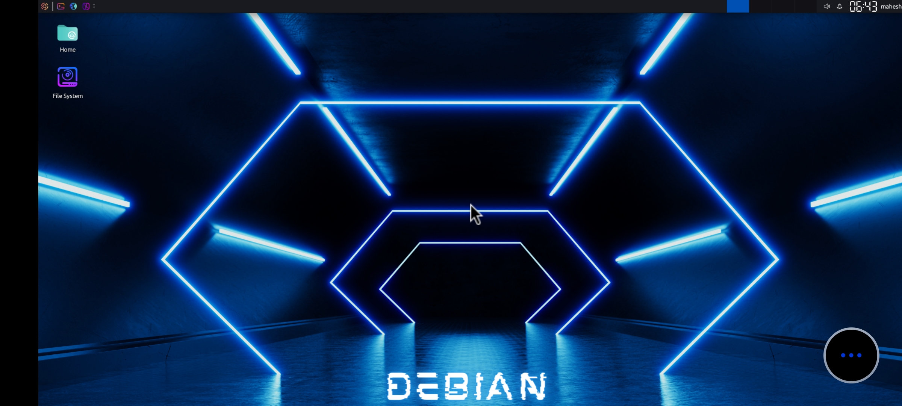
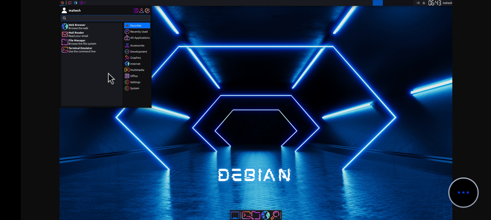

# 🐧 Moded Debian — KDE Plasma Edition



[](https://github.com/MaheshTechnicals/Moded-Debian/stargazers)
[](https://github.com/MaheshTechnicals/Moded-Debian/network/members)
[](https://github.com/MaheshTechnicals/Moded-Debian/issues)
[](./LICENSE)
[](https://github.com/MaheshTechnicals/Moded-Debian/commits/main)

**Run Debian Linux with KDE Plasma GUI on Android using Termux — fast, stable, and beautifully customized.**  
Experience the power of a full KDE Plasma desktop environment directly on your Android device with Modded Debian by Mahesh Technicals.

This enhanced version comes with preinstalled developer tools, optimized performance, and the modern KDE Plasma graphical interface that brings the true Linux experience to mobile.

---

## 🚀 Key Features

✅ **KDE Plasma Desktop** — Full KDE Plasma 5 desktop with Breeze Dark theme  
✅ **Audio Fixed** – Full sound support in Termux (Proot-Distro)  
✅ **Lightweight RootFS** – Requires only ~6 GB storage  
✅ **Triple Browser Setup** – Firefox (default) + Chromium + Brave, all auto-installed  
✅ **Firefox as Default** – Set system-wide via xdg-settings, update-alternatives, mimeapps & kdeglobals  
✅ **Bangla Font Support** – Perfect for multilingual users  
✅ **Preinstalled Media Players** – VLC & MPV  
✅ **Code Ready** – Visual Studio Code (arm64/aarch64) & Cursor AI Editor  
✅ **Konsole Terminal** – KDE's feature-rich terminal emulator  
✅ **Dolphin File Manager** – KDE's powerful file manager  
✅ **KDE Apps Included** – Kate editor, Gwenview, Spectacle, Ark, KScreen  
✅ **Breeze-GTK Theme** – GTK apps match KDE's Breeze look  
✅ **User-Friendly Installer** – Designed for beginners  
✅ **Optimized for proot/VNC** – Compositing disabled for maximum performance  
✅ **proot-distro v5.x Compatible** – Works with both new OCI and legacy rootfs paths  

---

## 📦 Installation Guide

### 🧩 Step 1 — Install Termux & Termux:API

To get started, you need to install both the **Termux** app and the **Termux:API** add-on.  
These two applications work together to enable full system functionality and hardware integration.

#### 📱 Download Links
- **🔗 Termux App (v0.118.3)** — [Download from GitHub](https://github.com/termux/termux-app/releases/tag/v0.118.3)  
- **🔗 Termux:API Add-on (v0.53.0)** — [Download from GitHub](https://github.com/termux/termux-api/releases/tag/v0.53.0)

> 💡 **Note:** Both apps are officially maintained on GitHub. Avoid downloading from the Google Play Store, as it may contain outdated versions.

### Step 2 — Clone Repository and Setup
```bash
apt update && apt upgrade -y
pkg install git wget -y
git clone --depth=1 https://github.com/MaheshTechnicals/Moded-Debian.git
cd Moded-Debian
bash setup.sh
```

### Step 3 — Launch Debian CLI
After installation completes, **restart Termux** and type:
```bash
debian
bash user.sh
```
> Enter your root username (lowercase, no spaces).

### Step 4 — Launch KDE Plasma GUI Setup
Restart Termux again and type:
```bash
debian
sudo bash gui.sh
```
> Set and remember your **VNC password**.

### Step 5 — Start and Stop KDE Plasma
```bash
vncstart   # Start KDE Plasma GUI
vncstop    # Stop KDE Plasma GUI
```

### Step 6 — Connect Using VNC Viewer
1. Install **[VNC Viewer](https://play.google.com/store/apps/details?id=com.realvnc.viewer.android&hl=en)** on your phone.  
2. Create a new connection:
   - **Address:** `localhost:1`
   - **Name:** `Debian KDE`
   - **Quality:** High
3. Connect & enjoy KDE Plasma Desktop on Android!

---

## 💡 Notes

- Use `debian` command anytime to enter the Debian CLI.  
- To start the GUI session: `vncstart`  
- To stop the GUI session: `vncstop`  
- Restart a crashed Plasma shell: `plasma-restart`  
- To **remove Debian completely**, run:
  ```bash
  bash remove.sh
  ```
- You must have **at least 6 GB free storage** before installation (KDE Plasma requires more than XFCE4).

---

## 🎥 Video Tutorial

Watch the setup tutorial below for a complete walkthrough:  
[](https://mega.nz/embed/QvIC1TLQ#3z27MRNPwANAg6JTtx1Ei8kDouOZsZgk00bg4TsJMNQ!1m)

---

## 🔄 Changelog

See the full list of updates and improvements here:  
👉 [CHANGELOG.md](./CHANGELOG.md)

---

## 🛠️ Technical Info

| Property | Value |
|---|---|
| Base Distro | Debian (Proot-Distro) |
| Architecture | aarch64 / arm64 |
| Display Server | TigerVNC |
| Desktop Environment | **KDE Plasma 5** |
| Window Manager | KWin (X11) |
| Terminal | Konsole |
| File Manager | Dolphin |
| Developed For | Android (Termux) |
| Minimum Storage | 6 GB free |
| proot-distro Compatibility | v4.x (legacy) and v5.x (OCI-based) |

---

## 🧠 Troubleshooting

**Q:** VNC session not connecting?  
**A:** Restart Termux and type:
```bash
debian
vncstart
```
Then reconnect via VNC Viewer.

**Q:** KDE Plasma shell crashed or desktop is empty?  
**A:** Run inside the VNC session terminal (Konsole):
```bash
plasma-restart
```
Or from CLI:
```bash
kquitapp5 plasmashell && kstart5 plasmashell &
```

**Q:** Audio not working?  
**A:** Run `pavucontrol` inside the Debian GUI and make sure the output device is not muted.

**Q:** Screen is black / KDE not loading?  
**A:** Compositing is disabled by default for proot/VNC stability. If the desktop still doesn't appear, run `vncstop` then `vncstart` again.

**Q:** Got "Error Installing Distro!" even though Debian downloaded fine?  
**A:** You are likely on proot-distro v5.x. The setup script auto-detects both old and new rootfs paths. Re-run `bash setup.sh` with the latest version of this repo.

---

## 🧑‍💻 Maintainer

**Mahesh Varma (Mahesh Technicals)**  
📧 [help@maheshtechnicals.com](mailto:help@maheshtechnicals.com)  
🌐 [GitHub Profile](https://github.com/MaheshTechnicals)

---

## 📝 License

This project is licensed under the [Apache License](./LICENSE).

---

## 🙏 Credits

This project uses Debian images provided by **Termux Proot-Distro**.  
All credits to:
- [Termux Team](https://github.com/termux)
- [Proot-Distro Maintainers](https://github.com/termux/proot-distro)
- [KDE Community](https://kde.org)

---

## ⭐ Support & Contribution

If you like this project, please:
- 🌟 Star the repository  
- 🪄 Fork it and make improvements  
- 📣 Share it with your friends  

> "Linux isn't hard — it's just a new way to explore your Android!"

---

### 🔍 SEO Keywords

`debian termux`, `debian android`, `linux on android`, `termux debian setup`, `vnc viewer termux`, `moded debian`, `maheshtechnicals debian`, `debian kde plasma termux`, `proot distro debian`, `install debian termux gui`, `debian vnc setup android`, `kde plasma android termux`

---

## 💖 Support The Project

If you find this tool helpful and want to support my work, please consider buying me a coffee!

<a href="https://www.paypal.com/paypalme/Varma161" target="_blank"></a>

- **UPI:** `maheshtechnicals@apl`

---

**© 2025 Mahesh Technicals — All rights reserved**
